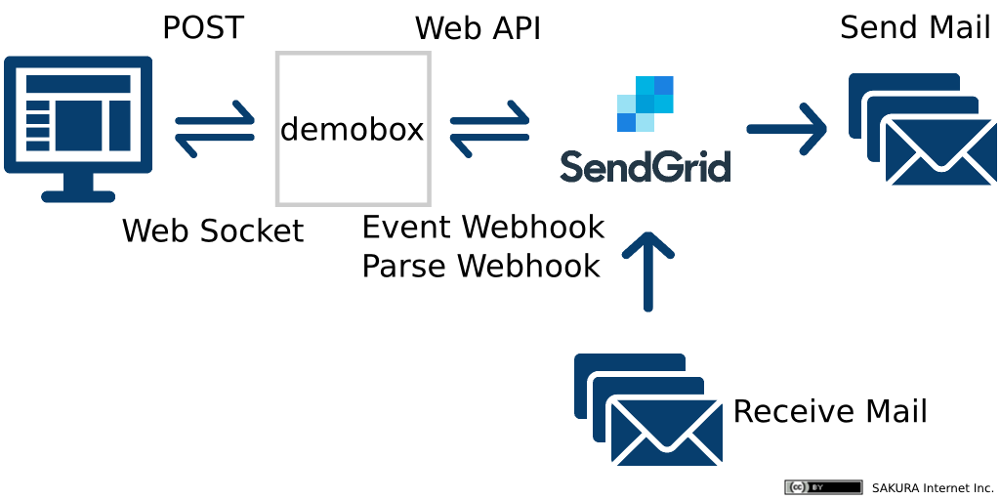
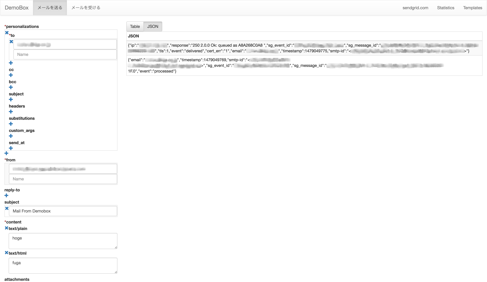
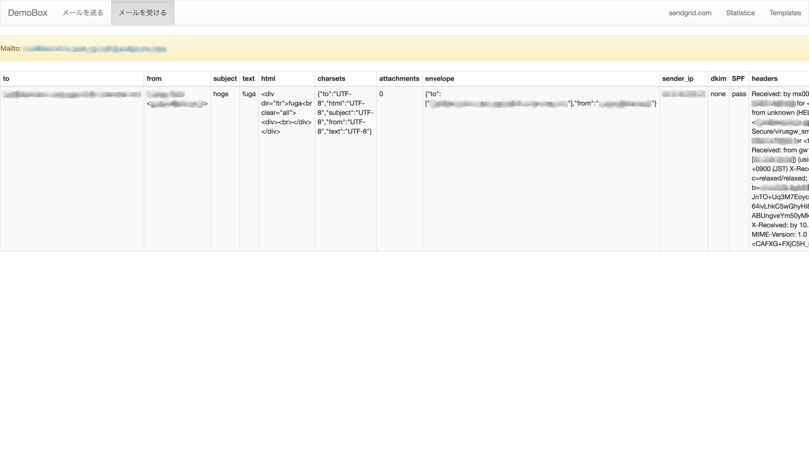

DemoBox
=============

## Ubuntu 14.04

### 前提条件

- SendGridアカウント
- Ruby 2.3.1
- Node.js 6.4.0
- Git
- インバウンドポート
  - TCP 9292:Rack
  - TCP 9000:Web socket



### セットアップ手順

- 環境の確認
```bash
$ ruby -v
ruby 2.3.1p112 (2016-04-26 revision 54768) [x86_64-darwin15]
$ node -v
v6.4.0
$ git --version
git version 2.6.2
```

- ソースコード取得
```bash
$ git clone https://github.com/SendGridJP/sendgrid-demobox.git
$ cd sendgrid-demobox
```

- 依存関係の解決
```bash
$ sudo apt-get install -y ruby-dev gcc build-essential
$ bundle install
$ npm install
$ bower install
$ grunt
```

- アプリケーション設定
```bash
$ cp .env.example .env
$ vi .env
SENDGRID_API_KEY=**sendgrid api key**
APP_URL=http://**server host name**
PARSE_HOST=**domain part which receives mails**
BASIC_AUTH_USERNAME=admin
BASIC_AUTH_PASSWORD=password
TO=**recipient@domain.com**
FROM=**your.address@domain.com**
```
各パラメータ詳細  

|パラメータ           |詳細                          |
|:--------------------|:------------------------------------|
|**SENDGRID_API_KEY**|SendGridのAPIキー。必要パーミッション(全てFull Access)：Mail Send、Template Engine、Inbound Parse、Mail Settings(Event Notification)|
|**APP_URL**          |アプリケーションのURL            |
|**PARSE_HOST**       |メールを受信するドメイン名。例：demobox.hoge.com        |
|**BASIC_AUTH_USERNAME**|基本認証のユーザ名（空白可）             |
|**BASIC_AUTH_PASSWORD**|基本認証のパスワード             |
|**TO**              |メール送信機能の宛先デフォルト値    |
|**FROM**              |メール送信機能の送信元デフォルト値    |

- アプリケーション起動
  - 開発環境
```bash
$ rackup
```
  - production環境
```bash
$ RACK_ENV=production rackup
```

- アプリケーションへのアクセス  
ブラウザで以下のURLにアクセス。
```text
http://x.x.x.x:9292
```

## 画面イメージ



